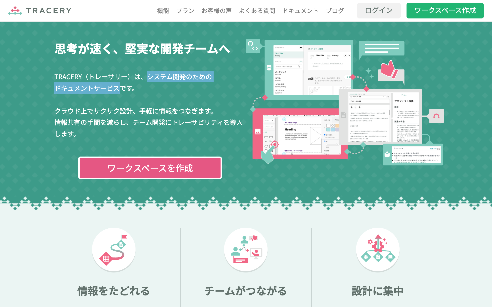
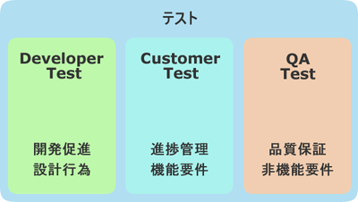

==========================================================
できる！Djangoでテスト!(2025)
==========================================================

| tell-k
| DjangoCongress JP 2025 (2025.02.22)

おまえ誰よ？
=====================================


* tell-k
* ビープラウド所属
* 情弱プログラマー
* https://twitter.com/tell_k
* https://tell-k.github.io/djangocongressjp2025/

ビープラウド- Pythonメインの受託開発
========================================


   https://www.beproud.jp/

connpass - エンジニアをつなぐIT勉強会支援プラットフォーム
===============================================================


   https://connpass.com/

PyQ - Pythonオンライン学習サービス
========================================


   https://pyq.jp/ 

TRACERY - システム開発のためのドキュメントサービス
==========================================================



   https://tracery.jp/ 

目的/動機
=====================================

* **7年前(2018年)** にも同じテーマで発表させていただきました
* テストに対する方針などの基本的な部分は変わらないものの、 **ツールや開発を取り巻く環境** は大きく様変わりしました
* たまに **「参考になりました」** と言ってもらうことがあるので、アップデートしておきたいと思いました

対象
=====================================

* Djangoをはじめようとしてる人
* ユニットテストとかをどうやってるのか知りたい人
* ある日、突然「 **いい感じにテスト書いて** 」と丸投げされて困惑してる人

今日の目標
=====================================


**あーなるほどね。完全に理解した**

主な参考文献
=====================================

* `テスト駆動開発 <https://www.amazon.co.jp/dp/4274217884>`_
* `xUnit Test Patterns <http://xunitpatterns.com/>`_
* `エキスパートPythonプログラミング改訂4版 <https://www.amazon.co.jp/dp/4048931113>`_
* `Pythonプロフェッショナルプログラミング 第4版 <https://www.amazon.co.jp/dp/B0CV9MSHZK>`_
* `自走プログラマー <https://jisou-programmer.beproud.jp/%E3%83%A6%E3%83%8B%E3%83%83%E3%83%88%E3%83%86%E3%82%B9%E3%83%88/index.html>`_
* `Pylons 単体テストガイドライン <http://docs.pylonsproject.jp/en/latest/community/testing.html>`_

  * `効果的なunittest - または、callFUTの秘密 <http://pelican.aodag.jp/xiao-guo-de-naunittest-mataha-callfutnomi-mi.html>`_

* この辺から用語/トピックをピックアップします。

前提&対象外
=====================================

* 非機能要件や受け入れテストの等の話はしません。
* テスト駆動開発そのものについては話しません。
* 3rd Party ライブラリではなく、一般的なDjangoプロジェクトを対象にしています

テストの種類
=========================================

* ユニットテスト <- **ほとんどこれの話**

  * 個々の関数やクラスをテストし、出力結果が予想通りであることを確認するテストです。

* 統合テスト

  * いくつかのモジュールを組み合わせて予想通りに動作するか確認するテスト。

* 機能テスト

  * ユーザーから見える範囲での機能を（例えばブラウザを使って）テストします。確実に想定した動作をするかといった内部構造は考慮しません。

ユニットテストに期待すること
===================================

* 実装が意図した通りに動くか素早く確認できること
* 不安なくリファクタリングを始められるようになること
* テストコード自体が簡単なドキュメントの役割を果たしてくれること

**「自分が書いたコードが期待通りに動いている」ことを確認する**

Developer Testing
===================================



   via. `第3回　「テスト」という言葉について <http://gihyo.jp/dev/serial/01/tdd/0003>`_

目次
==========================================

* pytest(pytest-django)
* テスト設置場所
* テストケースを書く
* テストを実行する
* フィクスチャー
* モック 
* コードカバレッジ
* 雑多なネタ
* まとめ

pytest(pytest-django) 
===================================

* 2018年当時もすでに ``pytest`` は人気のライブラリでした
* だた ``pytest`` および ``pytest-django`` を採用してるプロジェクトが私の周りではあまりありませんでした
* ですが2025年現在では **pytestを使ってないプロジェクトをほぼ見ない**  という状況になりました
* Pythonでテストを書くためのデファクトスタンダードになった印象です

なぜ pytest なのか？
===================================

* テストの書きやすさのハードルが低い
  
 * ツール特有の書き方を覚える必要がない

* 賢いテストランナー

 * `pytest` とコマンドを打つだけでテストを自動収集してくれる

* 詳細なエラーメッセージ 
  
 * `assert` の挙動がカスタマイズされているのでエラーがみやすい
 
* 豊富なフィクスチャ機能

  * `pytest-django` に沢山あるのでテストしやすい


テスト設置場所
================================

* Djagnoアプリの直下に ``tests`` パッケージを用意
* アプリ内のモジュールに対応する、モジュールを作成する
* 厳格にルールがあるわけではなく外出しする人もいます

.. code-block:: bash

 spam
    ├── __init__.py
    ├── admin.py
    ├── apps.py
    ├── forms.py
    ├── models.py
    ├── utils.py
    ├── urls.py
    ├── views.py
    └── tests < -- here
       ├── __init__.py
       ├── test_admin.py  
       ├── test_forms.py
       ├── test_models.py
       ├── test_utils.py
       └── test_views.py

テストケースを書く
=============================

単純な関数をテストしたい
=============================

* 例えば以下のような関数をテストしたい

.. code-block:: python

  # spam/utils.py ----
  from datetime import date
  
  def diff_days(from_date: date, to_date: date) -> int | None:
      """ 日付の差分日数を返す """
      if from_date >= to_date:
          return None
      return (to_date - from_date).days
  
  # Usage --
  date1 = date(2025, 1, 1)
  date2 = date(2025, 1, 6)
  
  print(diff_days(date1, date2)) # => 5
  print(diff_days(date2, date1)) # => None


unittestの場合
=============================

.. code-block:: python

 # spam/tests/test_utils.py ----
 import unittest
 from datetime import date
 
 class TestDiffDays(unittest.TestCase): 
 
     def _callFUT(self, from_date, to_date):
         from spam import diff_days 
         return diff_days(from_date, to_date)
 
     def test_valid_case(self): 
         actual = self._callFUT(date(2018, 1, 1), date(2018, 1, 6))
         self.assertEqual(5, actual)
 
     def test_none_case(self):
         actual = self._callFUT(date(2018, 1, 6), date(2018, 1, 1))
         self.assertIsNone(actual)

pytestの場合
=============================

.. code-block:: python

 # spam/tests/test_utils.py ----
 import pytest
 from datetime import date
 
 class TestDiffDays: # <- 継承不要

     @pytest.fixture 
     def target(self):
         from spam import diff_days 
         return diff_days
 
     def test_valid_case(self, target): 
         actual = target(date(2018, 1, 1), date(2018, 1, 6))
         assert 5 == actual # <- assert でOK
 
     def test_none_case(self, target):
         actual = target(date(2018, 1, 6), date(2018, 1, 1))
         assert actual is None

書き方がシンプルになる
=============================

* 継承せずに素のPythonクラスをテストケースにできる
* ``assert`` の挙動が変えられてるので、失敗した時の差分がとても見やすい

  * ``assertXXXX`` のメソッド群を覚える必要がない

Pylons 単体テストガイドライン
===================================

* Pylons Project の公開している単体テストガイドライン
  
  * `Pylons 単体テストガイドライン <http://docs.pylonsproject.jp/en/latest/community/testing.html>`_
  * Pythonでテストを書く時の指針として簡潔、わかりやすくまとまっている
  * テストについて聞かれた時に良くおすすめしています

* ここでは以下のルールに沿っています。

  * `ルール: テスト対象のモジュールをテストモジュールのスコープでインポートしない <http://docs.pylonsproject.jp/en/latest/community/testing.html#id3>`_
  * `ルール: 各テストケースメソッドは、 1つのことだけをテストする <http://docs.pylonsproject.jp/en/latest/community/testing.html#id3>`_

テスト対象をモジュールのスコープでインポートしない
=============================================================================

* モジュールのスコープでインポートエラーになると、関係ないテストまで **失敗します**
* できる限り他のテストケースに影響を与えない方が良い

.. code-block:: python

 # Pylonsのガイドラインでは `_callFUT` メソッド名
 # FUT = Function Under the Test = テスト対象の関数

 @pytest.fixture
 def target(self):
     from spam import diff_days 
     return diff_days

 # キーワード引数として自動的に渡ってくる
 def test_valid_case(self, target): 
 

モジュールの全てのテストが失敗してしまう
===============================================================

.. code-block:: python

 # Bad ----

 from spam import diff_days  # ImporErrorになるとする

 class TestDiffDays: 
 
     def test_valid_case(self): 

 # ↓  関係ないテストも落ちてしまう
 class TestOther:

     def test_other(self): 


テストケースは、 1つのことだけをテストする
=========================================================

* 全部のテストパターンをごちゃまぜにしない。
* テストが落ちた時に原因が掴みにくくになる
* `20:1つのテストメソッドでは1つの項目のみ確認する <https://jisou-programmer.beproud.jp/%E3%83%A6%E3%83%8B%E3%83%83%E3%83%88%E3%83%86%E3%82%B9%E3%83%88/20-1%E3%81%A4%E3%81%AE%E3%83%86%E3%82%B9%E3%83%88%E3%83%A1%E3%82%BD%E3%83%83%E3%83%89%E3%81%A7%E3%81%AF1%E3%81%A4%E3%81%AE%E9%A0%85%E7%9B%AE%E3%81%AE%E3%81%BF%E7%A2%BA%E8%AA%8D%E3%81%99%E3%82%8B.html>`_

.. code-block:: python

  # Bad ----

  def test_all_test_cases(self, target): 
      # from_date < to_date 
      actual = target(2018, 1, 1), date(2018, 1, 6))
      assert actual == 5

      # from_date >= to_date 
      actual = target(date(2018, 1, 6), date(2018, 1, 1))
      assert actual is None 
  

同値分割/境界値分析
=======================================

* **何を気にしてテストを書くのか？**
* 同値分割 ... テスト結果をグループ化し代表的な条件をピックアップしてテスト
* 境界値分析 ... テスト結果が変わる境目となる条件をテスト

  * 例えば 日付の範囲、数値の範囲
  * テストケースが成立するエッジケースをテストする
  * **境界値は分岐の条件になることも多いのでバグが起こりやすい**

同値分割/境界値分析
=======================================

.. code-block:: python 

 def test_boundary_case1(self, target): 
   # 1が返る境界値をテストする
   actual = target(date(2018, 1, 1), date(2018, 1, 2))
   assert actual == 1

 def test_boundary_case2(self, target):
   # Noneが返る境界値をテストする
   actual = target(date(2018, 1, 1), date(2018, 1, 1))
   assert actual is None


Assertion Roulette
=======================

* xUnit Patterns の `テストの不吉な臭い <http://xunitpatterns.com/Test%20Smells.html>`_ の一つ
* 1つのテストケースで複数の入力パターンをテストしている

このような場合

* どのデータが原因でテストが失敗したかわかりにくい
* テスト失敗以後のアサーションが行われない

.. code-block:: python

  # Bad --

  def test_say_hello(self, target): 

      assert target(None) == 'hello tell-k'  # 1. ここで失敗
      assert target('hirokiky') == 'hello hirokiky' # 2. 以後のアサーションは無視
      assert target('django') == 'hello django'
      assert target('kashew') ==  'hello kashew'

Parameterized Test
==================================

* 複数の入力パターンで同一のテストケースを実行する
* `pytest.mark.parametrize <https://docs.pytest.org/en/latest/parametrize.html>`_

.. code-block:: python

 # Good --

 @pytest.mark.parametrize("input_str,expected", [
     (None, "hello tell-k'"),  # このテストが失敗しても他のテストは実行される
     ("hirokiky", "hello hirokiky'"), 
     ("django", "hello django'"), 
     ("kashew", "hello kashew'"), 
 ])
 def test_say_hello(self, input_str, expected): 

     assert target(input_str) == expected

* `現在時刻が関わるユニットテストから、テスト容易性設計を学ぶ <https://t-wada.hatenablog.jp/entry/design-for-testability>`_

Djangoモデルに依存するテストケース
==================================================

* DjangoモデルつまりDBに依存するようなテスト
* ``pytest.mark.django_db`` というマーカーを利用します。
* このマーカーを利用するとテストケースごとにDBを初期化してくれます

pytest.mark.django_db
========================

- ``pytest.mark.django_db`` マーカーはデコレーターとして利用できます。

.. code-block:: python

 import pytest

 from sample.models import Item
 
 # ↓ このクラステストケースが実行されるたびにDBをクリアしてくれる
 @pytest.mark.django_db
 class TestSample:
 
     def test_one(self):
         Item.objects.create(name='name1')

         assert 1 == Item.objects.all()
 
     # テストケースが終わるとDBの中身はクリア(rollbackされる)
     def test_two(self):
         Item.objects.create(name='name1')

         assert 1 == Item.objects.all()


マーカーを書く場所によって挙動が変わる
=================================================

* マーカーを書く場所によってマーカーの有効範囲を調整できる

.. code-block:: python

 # モジュール全体でマーカーが利用される
 pytestmark = pytest.mark.django_db

 # このクラスのみマーカー適用
 @pytest.mark.django_db 
 class TestSample:
 
     # このメソッドのみマーカー適用
     @pytest.mark.django_db 
     def test_one(self):
         Item.objects.create(name='name1')

         assert 1 == Item.objects.all()


テストを実行する
=======================================

* **pytest-django** のための設定が必要
* **pyproject.toml** 等の設定ファイルで **DJANGO_SETTINGS_MODULE** を指定する

.. code-block:: ini

  [tool.pytest.ini_options]
  DJANGO_SETTINGS_MODULE = "test.settings"
  # -- recommended but optional:
  python_files = ["test_*.py", "*_test.py", "testing/python/*.py"]

* あとは実行するだけ( **自動的にテストケースを収集してくれます** )

.. code-block:: bash

 $ pytest

pytest実行時の注意点
=======================================

* たまにハマる人がいる注意点
* デフォルトではテストケースには  ``TestXXX`` という風に ``Test`` プレフィックスが必要
* 関数やメソッドであれば ``test_`` というプレフィックスが必要

  * https://stackoverflow.com/a/20277099
  * http://pytest.readthedocs.io/en/latest/goodpractices.html#conventions-for-python-test-discovery

* ``XxxTest`` のような名前にしてしまうと無視されてしまう

  * 気づかずにテストが通ったと勘違いしてしまう

どこまでユニットテストの対象にすべきか? 
===============================================

* 自分たちが書いたコードに対してテストを書く
* Djangoやサードパーティのライブラリのテストしない
* テスト対象が依存してる処理/コンポーネントは対象としない

  * 個別にユニットテストする
  * 依存部分はモック(後述)などで置き換える

* デバッグ目的のコードは意図的にテストしないこともある

フィクスチャー
=============================

フィクスチャー
=============================

* テストに必要な状態や条件を用意した環境やデータのこと
* ``pytest.fixture``` もそのままフィクスチャー
* xunitスタイルの前処理/後処理用のhookも用意されいている
   * ``setup_method`` ... テストケース実行前の処理
   * ``teardown_method``  ...  テストケース実行後の処理

フィクスチャー
=============================

.. code-block:: python

 # Bad ----
 class TestDoSomething:
     @pytest.fixture
     def target(self):
         from sample.api import do_something
         return do_something

     def setup_method(self, method):
         self.good_data = make_fixture_data(good=True) # フィクスチャーの生成
         self.bad_data = make_fixture_data(bad=True)

     def teardown_method(self, method):
         destory_fixture(self.good_data) # フィクスチャーの破棄
         destory_fixture(self.bad_data)
         
     def test_do_something_ok(self, target):
         assert target(self.good_data) is True

     def test_do_something_ng(self, False):
         assert target(self.bad_data) is False


self属性でセットアップを共有しない
=========================================

* `ガイドライン: self の属性によってではなく、ヘルパーメソッドによってセットアップを共有する <http://docs.pylonsproject.jp/en/latest/community/testing.html#self>`_
* あるテストケースでは必要でも、他のテストケースでは必要ない
  
  * 無駄に生成している

* テストケース毎にカスタマイズしづらい
* 無駄なフィクスチャー生成が省ければ、テストの実行も早くなる

self属性でセットアップを共有しない
========================================

.. code-block:: python

 # Good --
 
 @pytest.fixture
 def good_data():
     data = make_fixture_data(good=True)
     yield data # ジェネレータを使うことで後処理を挟める
     destory_fixture(good_data)

 @pytest.fixture
 def bad_data():
     data = make_fixture_data(bad=True)
     yield data
     destory_fixture(bad_data)

 class TestDoSomething:
     @pytest.fixture
     def target(self):
         from sample.api import do_something
         return do_something

     def test_do_something_ok(self, target, good_data): # good_dataのみが生成される
         assert target(good_data) is True

     def test_do_something_ng(self, target, bad_data): # bad_dataのみが生成される
         assert target(bad_data) is False 


Djangoモデルのフィクスチャー
==========================================

* `factory_boy <http://factoryboy.readthedocs.io/en/latest/>`_
* Djangoモデルのをいい感じに用意してくれる 
* Django以外にもSQLAlchemy、MongoEngineなど対応してくれる
* 同種のものに  `Model Bakery <https://model-bakery.readthedocs.io/en/latest/>`_ がある

factory_boy
==========================================

.. code-block:: python

 # sample/tests/factories.py  
 import factory
 
 class ItemFactory(factory.django.DjangoModelFactory):
     name = factory.Sequence(lambda n: 'name{}'.format(n))
     email = factory.Sequence(lambda n: 'hoge{}@example.com'.format(n))
     price = 100 
     owner = factory.SubFactory("account.tests.factories.UserFactory")
 
     class Meta:
         model = "sample.Item"

.. code-block:: python

  item = ItemFactory()
  print(item.name) # => name0
  print(item.user) # => User object

  # フィールドの値も指定できる
  ItemFactory(name='newitem')

  # 一気に複数オブジェクトを生成することもできる
  ItemFactory.create_batch(10)

factroy_boy のハマりポイント1
=================================

* ItemFactoryをいろんなテストケースで共用したとする
* デフォルト値に依存したテストを書いてしまう
* **誰かが知らずにデフォルト値を変更するとテストが失敗する**
* Fragile Test(Fragile Fixture) ... `テストの不吉な臭い <http://xunitpatterns.com/Test%20Smells.html>`_

  * フィクスチャの準備をするコードを修正したら、無関係なテストが失敗する

.. code-block:: python

  # テスト対象
  def get_display_price(item):
      return "{}円".format(item.price)

.. code-block:: python

  # Bad --
  def test_display_price(self, target):
      item = ItemFactory()  # <- ItemFactory.price 100から変更されたらテスト失敗
      expected = '100円'
      assert expected == target(item)


factroy_boy のハマりポイント1
=================================

* テストケースで必要なデータは、テストケース内で生成する

.. code-block:: python
  
 # Good --
 def test_display_price(self, target):
     item = ItemFactory(price=100) # <- 100固定
     expected = '100円'
     assert expected == target(item)

* デフォルト値に依存しないテストにする

.. code-block:: python

 # Good --
 def test_display_price(self, target):
     item = ItemFactory()
     expected = '{}円'.format(item.price)  # <- item.price を使って期待値を生成
     assert expected == target(item)


factroy_boy のハマりポイント2
=================================

* **簡単にモデルを生成できるようになっていない**
* 直接Djangoモデルを使ってるのとあまり変わりがない

.. code-block:: python

  # Bad ----
  def test_check_hoge(self, target):
      piyo = PiyoFactory(
        name="piyo", 
        attr1="attr1",
      )
      fuga = FugaFactory(
        piyo=piyo,
        name="fuga", 
      )
      # HogeFactoryのモデルが欲しいだけなのに
      # 外部キーで繋がるモデルまで用意している
      hoge = HogeFactory(
        fuga=fuga,
        name="hoge",
      )

      expected = "this is valid hoge"
      assert expected == target(hoge)

factroy_boy のハマりポイント2
=================================

* ``SubFactory`` や  ``Sequence`` を活用し **引数なし** でモデルを生成できると良いです。
*  **テストケースに直接必要ないデータを楽に用意できる** のが大きなメリットです。

.. code-block:: python

  # Bad ----
  def test_check_hoge(self, target):

      hoge = HogeFactory(
        name="hoge",
      )

      expected = "this is valid hoge"
      assert expected == target(hoge)


モック
=================================

モック
=================================

* テスト対象が依存してる処理/コンポーネントを置き換える
* 例えば、以下のようなものを置き換える
   
  * 構築の準備に手間がかかるオブジェクト
  * 実際にネットワーク通信が必要になる処理 => 外部APIとの通信
  * テスト実行時に変化する値、日付

* xUnit Test Patterns では **Test Double** として分類/整理されている
* `xUnit Test PatternsのTest Doubleパターン(Mock、Stub、Fake、Dummy等の定義) <http://goyoki.hatenablog.com/entry/20120301/1330608789>`_

Test Double
=================================

.. figure:: _static/img/test_double.gif
   :width: 80%

Test Double
=================================

* **間接入力** ... テストコードから見えないテスト対象への入力
* **間接出力** ... テストコードから見えないテスト対象の出力

----

* **Dummy Object** ... テストに影響を与えない代替オブジェクトです。
* **Test Stub**    ... 間接入力値をテスト対象に返す
* **Test Spy**     ... 間接出力値を記録/参照可能にする
* **Mock Object**  ... 間接出力を記録/検証可能にする
* **Fake Object**  ... 実際のオブジェクトに近い処理をするが、簡易な実装となっている

----

* モック(=Test Dobule) の意として話します

pytest-mock
==================================

* ``pytest-mock`` は ``unittest.mock`` を ``pytest`` で使いやすくするラップしたライブラリです。

.. code-block:: python

  # sample/api.py ---
  from item.api import calc_tax_included_price

  # テスト対象
  def get_display_price(item):
      price = calc_tax_included_price(item)  # <- これをモック(Test Stub)に置き換える
      return "{}円".format(price)

.. code-block:: python

  def test_display_price(self, target, mocker): # <- mocker が自動で渡される
      item = ItemFactory()

      # patch を通して 108 という間接入力値 をテスト対象(get_display_price) に渡してる
      with mocker.patch('sample.api.calc_tax_included_price', return_value=108) as m:
           expected = '108円'
           
           assert expected == target(item)  # => OK 

           # calc_tax_included_price に item引数が渡ったかチェック
           m.assert_called_with(item)

 
patch の ハマりポイント
================================

* ``patch`` がうまく当たらないケースがある

.. code-block:: python
 
  # egg.py  ---
  import spam

  def say_egg():
      return spam.say_spam() # <- patch対象

.. code-block:: python

  from unittest import mock
  from egg import say_egg

  with mock.patch('spam.say_spam', return_value="Patched!"):
      print(say_egg()) # => Patched! 

* 何の問題もなくパッチできている


patch の ハマりポイント
=================================

* 下記のように書き換えると **patchが失敗する**

.. code-block:: diff
 
 # egg.py  ---
 - import spam
 + from spam import say_spam

 def echo():
 -   return spam.say_spam()
 +   return say_spam()

* ``from import`` で importされたものは、元のモジュールから切り離される
* テスト対象( ``say_egg`` ) が利用してるものに ``patch`` をあてる。

.. code-block:: diff

 # Good
 
 - with mock.patch('spam.say_spam', return_value="Patched!"):
 + with mock.patch('egg.say_spam', return_value="Patched!"):
      print(say_egg()) # => Patched! 

* ``patch`` の影響下を局所化する意味でも import されてるところで patchする方が良いです。

モック その他
==================================

* 詳しいmockの使いかた

 * `まだmockで消耗してるの？mockを理解するための3つのポイント <http://note.crohaco.net/2015/python-mock/>`_

* ``datetime.now`` はpatchできない

 * ``django.util.timezone.now`` は patch可能
 * `Python: freezegun で時刻のテストを楽に書く <http://blog.amedama.jp/entry/2016/12/06/220000>`_

* HTTPリクエスト(``requests``)をモックしたい

  * `Responses <https://pypi.org/project/responses/>`_

モック その他2
==================================

* Redisをモックしたい

  * `FakeRedis <https://pypi.org/project/fakeredis/>`_

* patch を同時に複数あてたい

  * `contextlib.ExitStack <https://docs.python.jp/3/library/contextlib.html#contextlib.ExitStack>`_

可能な限り簡潔に
==================================

* `ガイドライン: fixture を可能な限り単純にしてください <http://docs.pylonsproject.jp/en/latest/community/testing.html#fixture>`_
* フィクスチャーやモックは可能限り簡潔にするのが良い
* モックを使いすぎて逆に何をテストしてるのか良くわからなくなってくる
* モック使いすぎ = **設計見直し/リファクタリングのチャンス**
    * `31:過剰なmockを避ける <https://jisou-programmer.beproud.jp/%E3%83%A6%E3%83%8B%E3%83%83%E3%83%88%E3%83%86%E3%82%B9%E3%83%88/31-%E9%81%8E%E5%89%B0%E3%81%AAmock%E3%82%92%E9%81%BF%E3%81%91%E3%82%8B.html>`_

コードカバレッジ
===============================

コードカバレッジ
===============================

* テストコードがテスト対象を、どれくらいパスしているか計測したもの
* これを計測しながらユニットテストを書いていくのが個人的におすすめです。
* 見るべきポイント

  * テストが意図した通りにパスしてるか
  * テストが書かれてない場所がないか確認
  * 不要なコードをないか(使われてない, 到達不能なコード)

コードカバレッジの分類
===============================

* C0: 命令網羅(statement coverage)

  * 全ての命令を一度は実行する

* C1: 分岐網羅(branch coverage)

  * 全ての分岐条件をパスする

* C2: 条件網羅(condition coverage)

  * 全ての条件をパスする

* C0/C1 くらいまでならカバレッジツールが計測できる

カバレッジの計測ツール
===============================

* `pytest-cov <https://pypi.org/project/pytest-cov/>`_ は ``coverage`` を ``pytest`` で使えるようにしたライブラリ
* 不要なカバレッジを計測しないように ``pyproject.tmol`` に除外対象を設定すると良いです

.. code-block:: ini

  [tool.coverage.report]
  omit = [
    "*/migrations/*",
    "apps/settings/*",
    "apps/manage.py"
  ]


カバレッジ
============================

* % もみるが、何行目がパスしてないかを良くみます

.. code-block:: bash

 $ pytest --cov apps --cov-report term-missing 

* 分岐網羅(C1)まで計測したければ ``--cov-branch`` オプションをつけて実行します

.. code-block:: text

  Name                          Stmts   Miss  Cover   Missing
  -----------------------------------------------------------
  account/__init__.py               1      0   100%
  account/admin.py                145     22    85%   19, 24-26, 59, 63-64, 100, 104-105, 137, 141-142, 173, 177-178, 209, 213-214, 247, 251-252
  account/apps.py                   9      0   100%
  account/forms.py                 29      0   100%
  account/models.py               239      0   100%
  account/views.py                150      5    97%   59, 101, 199

  〜 省略 〜
  -----------------------------------------------------------
  TOTAL                         28606   1240    96%

対象を絞ってテストする
=============================

* どこかで使われていて、たまたまカバレッジが上がってるだけのケース
* 対象を絞ってテストすることで...
  
 * **テストがない** ところがわかる
 * 素早くテストも終わる

.. code-block:: bash

 # 特定のモジュール
 $ pytest apps/account/tests/test_models.py

 # 特定のテストクラス
 $ pytest apps/account/tests/test_models.py::TestSpamClass

 # 特定のテストケース
 $ pytest apps/account/tests/test_models.py::TestSpamClass::test_spam

失敗したテストを最初に実行する
=====================================

* 同僚に教えてもらった、開発中によく使うオプションです。
* 開発しながら繰り返しテストする時に素早くテストできるので重宝しています
* ``--reuse-db`` ... DBを破棄せずに再利用するオプション
* ``--ff`` ... 直前に失敗したテストを最初に実行する
* ``-x`` ... テストケースが失敗したらその時点でテストを止める

.. code-block:: bash

 $ pytest --reuse-db --ff -x apps/account/tests/test_models.py

システム全体での カバレッジ 100% に固執しない
=====================================================

* **「カバレッジ100% = テストが書かれている」** ことがわかるだけ
* コードベースが巨大なほど、カバレッジをあげるのは大変になります。
* コード・システムの質は設計の見直し/リファクタリングを繰り返し行うことであがります。

先人たちのお言葉
================================

* 100％のテストカバレッジを誇りに思うということは、新聞のあらゆる言葉を読むことを誇りに思うようなものです。いくつかは他よりも重要です。(Kent beck)
* カバレッジ解析の価値は何なんだろう？まずは、テストが不十分なコードを見つけるのに役立つ。カバレッジツールをしょっちゅう実行して、テストのないコードを見つけておくのは価値のあることだ。それらのコードがテストされていないことで不安になるだろうか？ (Martin Fowler)

まとめ
=========================================

* 後から不安なく、設計を見直したり/リファクタリングできるようにテストを書こう
* まずはシンプルで必要十分なテストを書くところから始めよう
* フィクスチャーやモックのツールを使おう
* 先人達の知恵を有効活用しよう 

Kent Beck のお言葉
=========================================

* Tests are the Programmer's Stone, transmuting fear into boredom
* テストはプログラマーの石(?)、恐れを退屈に変えてくれます。
* **不安が退屈に変わるまでテストしよう**

参考
===============================

* Webページ や 書籍 の著者の皆さん 本当に ありがとうございます。m(_ _)m
* 7年後にまたお会いしましょう(テストを書くという仕事があるのか...)

ご静聴ありがとうございました
======================================

雑多なネタ
============

* 発表時間が余ってたら話します

テストランダムに実行する(pytest-randomly)
===================================================

* ``pytest-randomly`` は テストケースをランダムな実行順で実行する
* テストケース同士が依存していると、デバッグしづらいし、バグになっている可能性がある
* ランダムに実行すること、実行順に依存していた場合にバグに気づきやすくなります
* `28:テストの実行順序に依存しないテストを書く <https://jisou-programmer.beproud.jp/%E3%83%A6%E3%83%8B%E3%83%83%E3%83%88%E3%83%86%E3%82%B9%E3%83%88/28-%E3%83%86%E3%82%B9%E3%83%88%E3%81%AE%E5%AE%9F%E8%A1%8C%E9%A0%86%E5%BA%8F%E3%81%AB%E4%BE%9D%E5%AD%98%E3%81%97%E3%81%AA%E3%81%84%E3%83%86%E3%82%B9%E3%83%88%E3%82%92%E6%9B%B8%E3%81%8F.html`>`_

3Aスタイルでテストを書こう
==============================

* テスト読むことで大まかな仕様を把握できることもあるので可読性は大事です
* 準備と実行と検証の３つのチャンクに分けてあると良い
* `Arrange Act Assert <http://wiki.c2.com/?ArrangeActAssert>`_
* `21:テストケースは準備、実行、検証に分割しよう <https://jisou-programmer.beproud.jp/%E3%83%A6%E3%83%8B%E3%83%83%E3%83%88%E3%83%86%E3%82%B9%E3%83%88/21-%E3%83%86%E3%82%B9%E3%83%88%E3%82%B1%E3%83%BC%E3%82%B9%E3%81%AF%E6%BA%96%E5%82%99%E3%80%81%E5%AE%9F%E8%A1%8C%E3%80%81%E6%A4%9C%E8%A8%BC%E3%81%AB%E5%88%86%E5%89%B2%E3%81%97%E3%82%88%E3%81%86.html`>`_

.. code-block:: python

    def test_display_item(self, client, target):
        # arrange ---
        item = ItemFactory()

        # act ---
        res = client.get(target(item.id))

        # assert ---
        assert item.id == res.context['item'].id
        assert 200 == res.status_code
        assertTemplateUsed(res, 'item/detail.html')


viewのテストどうしてる？
==============================

* ``pytest`` に ``client`` フィクスチャがあるのでそれを使う
* ダミーのリクエストをアプリに対して実行できる

そもそもviewのテストは

* HTMLの中身まではあまりテストしない -> HTMLが頻繁に変わると辛いから
* 複雑なロジックはviewの中にかかない -> 外出してユニットテストを書く

viewのテストどうしてる？
==============================

.. code-block:: python

 import pytest
 from pytest_django.asserts import assertTemplateUsed

 @pytest.mark.django_db
 class TestItemDetailView:
 
     @pytest.fixture
     def target(self):
         def _inner(pk):
             return reverse('item:detail', kwargs={'pk': pk})
         return _inner
         
     def test_not_found(self, client, target):
         res = client.get(target(1))
         assert 404 == res.status_code
 
     def test_display_item(self, client, target):
         item = ItemFactory()

         res = client.get(target(item.id))

         assert item.id == res.context['item'].id
         assert 200 == res.status_code
         assertTemplateUsed(res, 'item/detail.html')

Eメール送信のテスト
==============================

* ``pytest`` に ``mailoutbox`` フィクスチャがあるのでそれを使う

.. code-block:: python

 from django.core import mail
 from django.test import TestCase
 
 class TestSendEmail():
 
     def test_send_email(self, mailoutbox):
 
         mail.send_mail('subject', 
                    'body.', 
                    'from@example.com', 
                    ['to@example.com'], fail_silently=False)
 
         assert len(mailoutbox) == 1
         assert mailoutbox[0].subject == 'subject'

Django コマンドのテスト
==============================

* `django.core.management.call_command <https://docs.djangoproject.com/en/2.0/ref/django-admin/#django.core.management.call_command>`_ でテストしている

.. code-block:: python

 from django.core.management import call_command

 class TestSpamCommand:

     @pytest.fixture
     def target(self):

         def _inner(*args, **kwargs):
            return call_command('spam', *args, **kwargs)
         return _inner

     def test_spam_command(self, target):
        target(ham=1)


ログ/標準出力の確認
==============================

* 明確にチェックしたいデータがあるわけではない場合、ログや標準出力で書き出された内容を確認したい時がある
* ``caplog`` という フィクスチャーでログ出力をチェックできます。

.. code-block:: python

 def test_baz(caplog):
     func_under_test()
     for record in caplog.records:
         assert record.levelname != "CRITICAL"
     assert "wally" not in caplog.text


テスト用に一時的にsettingsの中身を変更したい
==============================================

* ``settings`` フィクスチャ

.. code-block:: python

  def test_with_specific_settings(settings):
      settings.USE_TZ = True
      assert settings.USE_TZ

Celeryの非同期タスクのユニットテスト
=========================================

* 非同期でジョブが動く
* ちゃんと動かすには Celeryデーモンが必要

どうすれば良いのか？

* 同期的に実行するオプションがある
* ``CELERY_ALWAYS_EAGER = True`` 
* 関数としてそのままジョブの中身が実行される
* celeryデーモンも不要
* http://docs.celeryproject.org/en/3.1/configuration.html#std:setting-CELERY_ALWAYS_EAGER

tox
=========================================

* https://tox.readthedocs.io/en/latest/
* Pythonライブラリを複数バージョンでテストするツールです。
* 専用のvirtualenvを作ってくれる。
* テスト用のタスクとかまとめられる利点などがあります
* ``tox-uv`` を使うと ``virtualenv`` の代わりに ``uv`` で環境を構築してくれるので速くなります
* ``nox`` という pythonでかけるtoxみたいなツールも最近人気です。あまり使ったことないです。

テストの高速化
=========================================

* (特にローカルでは) テストを頻繁に実行するので、可能な限り速くなってほしい
   * 近年ではマシンスペックの向上や、Dockerコンテナの普及により、ミドルウェアを揃えるコストが格段に低くなったので、実ミドルウェアでテストしたりもしてます。
* `Djangoでテストを速くするためにいろいろやってみた <http://y0m0r.hateblo.jp/entry/20130615/1371305730>`_

トピック

* sqlite3 の in-meory DBを使う
* migrations を OFFにする
* PASSWORD_HASHERSの変更
* setupTestDataの利用検討
* ``pytest-xdist``  で並列実行
